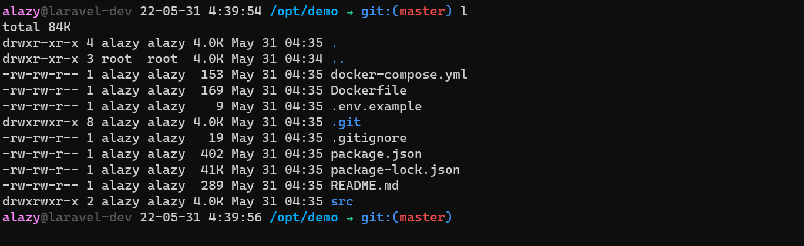

# cryo long zsh theme

[oh my zsh](https://ohmyz.sh/) theme
clone of [cryo](https://github.com/cryocaustik/cryo-zsh-theme/) theme with added hostname and full current directory.

[](sample.png)

## Install

```bash
# install ohmyzsh
sh -c "$(curl -fsSL https://raw.github.com/ohmyzsh/ohmyzsh/master/tools/install.sh)"

# download theme
curl -fsSL https://raw.githubusercontent.com/cryocaustik/cryo-long-zsh-theme/master/cryo-long.zsh-theme > ~/.oh-my-zsh/themes/cryo-long.zsh-theme

# change theme name in .zshrc
sed -i 's/ZSH_THEME=".*"/ZSH_THEME="cryo-long"/' ~/.zshrc

# reload .zshrc
. ~/.zshrc
```

## Credit

- [robbyrussel](https://github.com/ohmyzsh/ohmyzsh/wiki/Themes#robbyrussell): great core theme from which this was built
- [zsh-prompt-generator](https://zsh-prompt-generator.site/): great visual tool for customizing your prompt